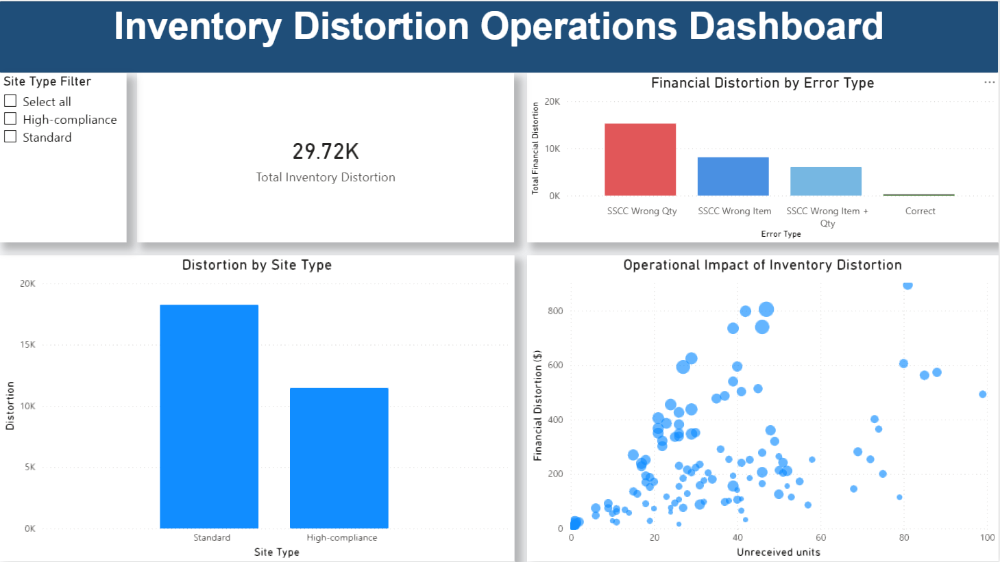

# Inventory Distortion Analysis (Power BI)

## Overview

This project analyzes **inventory distortion caused by SSCC receiving errors in warehouse operations**. The goal of the dashboard is to identify the **operational drivers behind inventory discrepancies** and quantify their **financial impact**.

Using **Power BI**, the dashboard visualizes total distortion, error types, and operational relationships between **unreceived units** and **financial loss**.

## Dashboard Preview

---

## Key Questions

The dashboard helps answer several operational questions:

- **What is the total financial impact of inventory distortion?**
- **Which error types cause the largest distortions?**
- **Do different site types experience different levels of distortion?**
- **How does operational failure scale with financial impact?**

---

## Dashboard Features

### KPI Summary
Displays the **total inventory distortion value** to provide a high-level view of financial impact.

### Error Type Breakdown
A categorical chart showing which **SSCC receiving errors contribute most to distortion**.

### Site Type Comparison
Compares distortion levels between **standard** and **high-compliance** sites.

### Operational Impact Analysis
A scatter plot visualizing the relationship between:

- **Unreceived units**
- **Financial distortion**
- **Unit cost impact**

### Interactive Filtering
Users can filter results by **site type** to explore how operational environments influence distortion patterns.

---

## Tools Used

- **Power BI** – Data visualization and dashboard design  
- **Data Modeling** – Aggregations and relationships within Power BI  
- **Operational Analytics** – Warehouse process analysis  

---

## Dataset

The dataset represents simulated warehouse receiving data and includes variables such as:

- `error_type`
- `site_type`
- `unreceived_units`
- `unit_cost`
- `value_distortion`
- `correction_minutes_est`

These variables allow analysis of both **financial** and **operational impacts** of receiving errors.

## Operational Insights

Analysis of the simulated receiving dataset highlights several operational patterns relevant to warehouse inventory control.

- **Higher distortion values** are associated with shipments containing large numbers of **unreceived units**, suggesting breakdowns in SSCC validation during the receiving process.

- **Standard sites** show higher overall distortion compared to **high-compliance sites**, indicating that stricter operational controls may reduce inventory discrepancies.

- Certain **error types contribute disproportionately** to financial distortion, especially when **high-cost units** are involved.

- The analysis suggests that **receiving errors involving high-value SKUs amplify financial risk**, even when the unit count is relatively small.

These findings demonstrate how operational errors in automated receiving systems can translate into measurable financial distortion and highlight the importance of **SSCC validation, process controls, and compliance monitoring** within warehouse operations.
